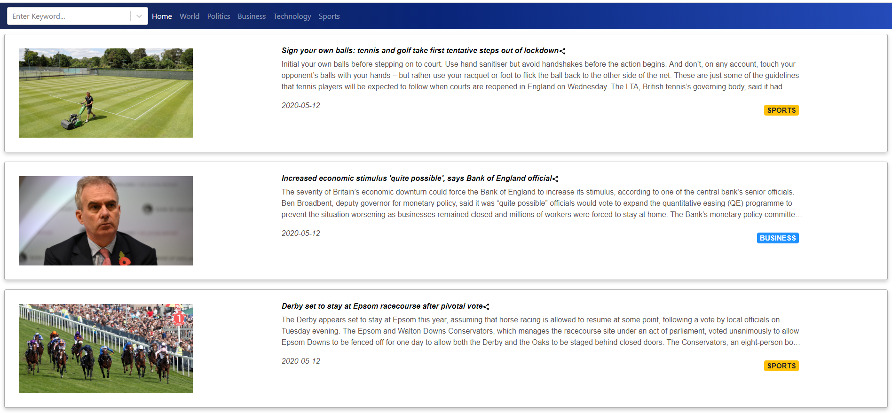

# News App
Demo link:  https://newsapp-johnnyko.herokuapp.com/       
  
This is a webpage to display top headlines for Guardian News. Based on the selection by the user, the top-headlines could be for any of the following domains – world, politics, business, technology and sports.  

- Used AJAX and JSON technologies.
- Used a combination of HTML5, React-Bootstrap, and React.js on client side.
- Used JavaScript / Node.js on server side.
- Used React-Bootstrap to enhance the user experience using responsive design.
- Delpoyed to Amazon Web Services(AWS), now Heroku.
- Used Guardian News API
 
